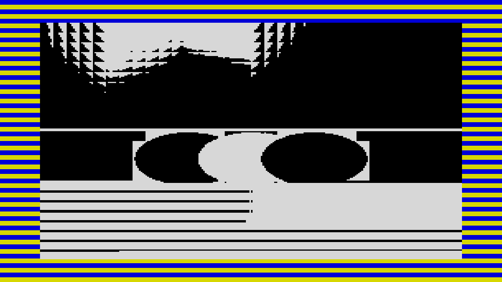

# pilot

> **AI-assisted project.** This codebase was created with [Claude](https://claude.com/claude-code)
> (Anthropic), directed and reviewed by a human author. **It has never been loaded
> into Resolume on macOS** (see [Status](#status) for Windows). Everything below is measured offline, through the real plugin
> class in a headless GL context: the address order exists twice — as the bit
> layout and as a plain nested loop — and `pttest --agree` proves the two agree for
> all 6144 addresses bitwise; `pttest --reveal` renders through the shipping shader
> and checks all 49,152 pixels against the independently written table, at two
> different output sizes, at six points in the load; and `pttest --error` measures
> the failure rate against 1/r over 20,000 seeded draws. `pttest --negative`
> deliberately breaks the model and asserts every one of those checks notices. A
> control sweep fails if any parameter turns out to do nothing (see
> [Building and testing](#building-and-testing)).

A tape loader for Resolume Arena/Avenue, as an FFGL effect. The clip arrives the
way a ZX Spectrum loaded it: **in screen-memory order, at the baud rate, with the
border painted by the loading signal itself.**

Most reveal transitions are a shape moving across a frame — a wipe, a circle, a
slab of noise. This one is not a shape at all. It is an **address order**: the
Spectrum's display file is not linear, so filling it from the start of the tape to
the end produces the pattern it produces, and nobody chose it.

Rendered by the plugin's own offline harness (<code>pttest</code>), not captured from Resolume.

<!-- downloads:start -->

## Download

**[v0.1.0](https://github.com/stoatworks-labs/pilot/releases/tag/v0.1.0)** — prebuilt for macOS and Windows. Pick your platform:

<b>macOS</b> — Universal (Apple Silicon + Intel)

| Build | Download | Size |
| --- | --- | --- |
| Universal (Apple Silicon + Intel) · .dmg disk image | [`pilot-0.1.0-macos-universal.dmg`](https://github.com/stoatworks-labs/pilot/releases/download/v0.1.0/pilot-0.1.0-macos-universal.dmg) | 209 KB |
| Universal (Apple Silicon + Intel) · .zip archive | [`pilot-macos-universal.zip`](https://github.com/stoatworks-labs/pilot/releases/latest/download/pilot-macos-universal.zip) | 173 KB |

<b>Windows</b> — x64

| Build | Download | Size |
| --- | --- | --- |
| x64 · .exe installer | [`pilot-0.1.0-windows-x86_64-setup.exe`](https://github.com/stoatworks-labs/pilot/releases/download/v0.1.0/pilot-0.1.0-windows-x86_64-setup.exe) | 216 KB |
| x64 · .zip archive | [`pilot-windows-x86_64.zip`](https://github.com/stoatworks-labs/pilot/releases/latest/download/pilot-windows-x86_64.zip) | 110 KB |

All builds, checksums and release notes: [github.com/stoatworks-labs/pilot/releases](https://github.com/stoatworks-labs/pilot/releases).

macOS builds are signed and notarised and open normally. The Windows builds are unsigned, so SmartScreen warns once.

<!-- downloads:end -->

## The one idea, and what falls out of it

For a pixel at (px, py), the byte holding it lives at

    third*2048 + line*256 + charrow*32 + xbyte

— which third of the screen, then which line within a character cell, then which
character row within that third. Take the rows apart in that order and put them
back in that order, and three things follow without being designed:

- **The picture does not wipe down the screen.** It arrives in three thirds, each
  filling in an eight-line interleave, which is the venetian-blind pattern
  everybody who watched a Spectrum load remembers.
- **Colour arrives last, all at once.** The 768-byte attribute file sits *after*
  the 6144-byte bitmap, so the image lands in monochrome and colours in over the
  final 11% of the load. Nothing schedules that; it is where the bytes are.
- **The border stripe period is the byte rate.** The border is not decoration —
  it is the loading signal. The ULA is told the current half-cycle's state and the
  beam paints it as it scans, so the stripes are horizontal and there are
  `baud / 50` pairs of them down the picture.

It is a transition in practice, and the fleet has none.

## Controls

- **Machine** — Type (ZX 48 / ZX 128 / C64 turbo / Amstrad), Baud, and the
  power-on attribute the picture wears before its own colours arrive: Ink, Paper,
  Bright. A Spectrum powers up black on white, and so does this.
- **Load** — Progress, Sync (Manual / Clip time / Beat / Bar), Error Rate, Message
  On. At Clip time the tape really does run at the baud rate: 6912 bytes at 1500
  baud is 37 seconds. Error Rate fails blocks at random, and a failed block prints
  `R Tape loading error, 0:1` in the Spectrum's own words before the load restarts.
- **Border** — Border On, Border Width, Pilot Length. Border Off is not a colour,
  it is the absence of a border: the screen fills the composition. Pilot Length is
  how much of the Progress range is spent on the pilot tone before the first byte
  lands — red and cyan on a Spectrum, then yellow and blue once data starts.
- **Output** — Mix, and Background: what an address that has not arrived yet
  shows. Paper is what a real machine shows; Clip turns the whole thing into a
  colour-and-quantise transition over the live picture.

## Status

**v0.1.0, built 2026-09-22 and released 2026-09-23, and honestly
early.**

User guide: [docs/USER-GUIDE.md](docs/USER-GUIDE.md), also at
https://stoatworks-labs.com/software/pilot/guide/

It has never been loaded into Resolume on macOS. On Windows it has: a CI build of the v0.1.0 source went through the fleet's Arena gate on 2026-09-23 (Resolume Arena 7.27.1 on win-lab, Mesa llvmpipe, no GPU) and passed 9 of 9 checks. It loads from Extra Effects, registers as `SW Pilot` / `PT01` / effect, all 20 host parameters (Arena's Opacity plus these 19) match the declaration in name, order, type, range and default, it renders, and Arena's log stays clean. 12 of the 15 controls the gate probes measurably moved the picture and 3 (Type, Baud, Message On) were inconclusive: the border stripes move every frame, so the picture's own noise floor (about 40 levels) hides smaller changes. None read as dead. It says nothing about speed or a real GPU.

Everything here is verified through the offline harness, which drives the real
plugin class headlessly — so how the parameters *present* (whether four groups
read sensibly in the inspector, whether the Ink and Paper dropdowns show as
colours, whether Arena's premultiplied textures behave) is untested on macOS, and
that is exactly what the harness cannot tell you.

What is measured, on one M4 Max: the address order agrees with its independent
derivation for all 6144 addresses, bitwise; the rendered frame matches the order
table for all 49,152 pixels at 1920×1080 **and** at 640×480, at six points in the
load, with zero disagreements; no attribute byte can be revealed before 6144; the
border advances by exactly 16 half-cycles per byte on every machine; the failure
rate matches 1/r within four standard errors over 20,000 draws at five rates; and
all 14 controls move the picture. Render cost is 0.09 ms/frame at 720p, 0.21 at
1080p and 0.36 at 4K — about 2% of a 60 fps frame at 4K, because the two
expensive passes run at 256×192 and 32×24 whatever the composition is (macOS
figures only).

CI (`ci.yml`) has run on GitHub's macOS runner, which has no GPU, so the harness
fell back to Apple's software renderer: the ten model checks, the two rasterising
checks (`--reveal`, `--pixels`) and the control sweep at 320×180 all passed on
that second rasteriser. The Windows x64 DLL is compiled with MSVC by
`release.yml` on GitHub.

Not done, and not pretended otherwise: no OpenFX port, no browser demo, no
factory presets, and the universal build has never run on an Intel Mac.
The `Baud` control drives the border's stripe rate and the Clip time period but
**not** the reveal rate in Manual mode, which is deliberate and explained in
AGENTS.md.

## Building and testing

C++17 + GLSL 4.10, CMake, FFGL 2.1 (SDK vendored as a submodule). macOS builds are
universal (arm64 + x86_64); Windows needs GLEW via vcpkg.

    git clone --recursive https://github.com/stoatworks-labs/pilot
    cmake -B build -DCMAKE_BUILD_TYPE=Release
    cmake --build build
    cmake --install build          # into Resolume's Extra Effects

Add `-DCMAKE_OSX_ARCHITECTURES=arm64` for a much faster dev build.

The harness renders the real plugin class headlessly. Ten of its twelve check
groups open **no GL context at all** — they run against the model in
`source/Spectrum.cpp` and `source/Loader.cpp`, so they cannot be a property of a
rasteriser or of a raster — and the two that do rasterise each run at two output
sizes on purpose:

    ./build/pttest --out /tmp/f.png              # the test card, mid-load
    ./build/pttest --agree                       # the two address derivations, bitwise
    ./build/pttest --order --thirds              # the reveal set, and the interleave
    ./build/pttest --attributes                  # no colour before 6144 bytes
    ./build/pttest --border                      # the stripe period, at two rasters
    ./build/pttest --error                       # blocks before a failure, against 1/r
    ./build/pttest --negative                    # break the model; every check must fail
    ./build/pttest --reveal --pixels             # through the real shader, two rasters
    ./build/pttest --bench                       # 720p through 4K
    ./build/pttest --pipe --size 1920x1080 --fps 30 --script cues.txt   # raw RGBA in, out: for filming
    python3 tools/sweep.py                       # no control is silently dead
    tools/verify.sh                              # all of it, from a fresh universal build

<!-- attributions:start -->
This project is built on other people's work — see [ATTRIBUTIONS.md](ATTRIBUTIONS.md).
<!-- attributions:end -->

## Licence

MIT.

The ZX Spectrum's display file layout, its 6912-byte screen and the 48K ROM
loader's border colours are published facts about a machine from 1982, implemented
here from descriptions of how the hardware behaved. No ROM, no BIOS and no
emulator code is present.
